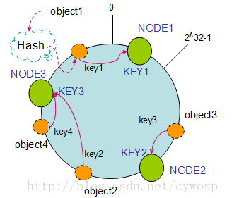

#### 缓存架构-一致性HASH算法详解

##### 基本场景

​		比如你有 N 个 cache 服务器（后面简称 cache ），那么如何将一个对象 object 映射到 N 个 cache 上呢，你很可能会采用类似下面的通用方法计算 object 的 hash 值，然后均匀的映射到到 N 个 cache；

###### 		求余算法: hash(object)%N

​		一切都运行正常，再考虑如下的两种情况；

* 一个 cache 服务器 m down 掉了（在实际应用中必须要考虑这种情况），这样所有映射到 cache m 的对象都会失效，怎么办，需要把 cache m 从 cache 中移除，这时候 cache 是 N-1 台，映射公式变成了 hash(object)%(N-1) ；
* 由于访问加重，需要添加 cache ，这时候 cache 是 N+1 台，映射公式变成了 hash(object)%(N+1) ；

​       1 和 2 意味着什么？这意味着突然之间几乎所有的 cache 都失效了。对于服务器而言，这是一场灾难，洪水般的访问都会直接冲向后台服务器；

​		再来考虑第三个问题，由于硬件能力越来越强，你可能想让后面添加的节点多做点活，显然上面的 hash 算法也做不到。

​		有什么方法可以改变这个状况呢，这就是 consistent hashing...

##### 一致性HASH

​		**一致性哈希的原理：由于一般的哈希函数返回一个int（32bit）型的hashCode。因此，可以将该哈希函数能够返回的hashCode表示成一个范围为0---（2^32）-1 环。将机器的标识（如：IP地址）作为哈希函数的Key映射到环上**。如：

`hash(Node1) =Key1      hash(Node2) = Key2`

​		借用一张图如下：

​		同样，数据也通过相同的哈希函数映射到环上。这样，按照顺时针方向，数据存放在它所在的顺时针方向上的那个机器上。这就是一致性哈希算法分配数据的方式！

​		衡量一致性哈希算法好处的四个标准：

①平衡性：平衡性是指哈希的结果能够尽可能分布到所有的缓冲中去，这样可以使得所有的缓冲空间都得到利用。

②单调性：单调性是指如果已经有一些数据通过哈希分配到了相应的机器上，又有新的机器加入到系统中。哈希的结果应能够保证原有已分配的内容可以被映射到原有的或者新的机器中去，而不会被映射到旧的机器集合中的其他机器上。

这里再解释一下：就是原有的数据要么还是呆在它所在的机器上不动，要么被迁移到新的机器上，而不会迁移到旧的其他机器上。

③分散性

④负载