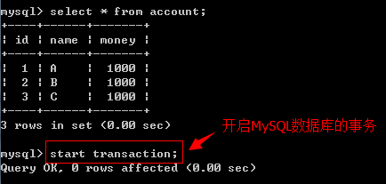
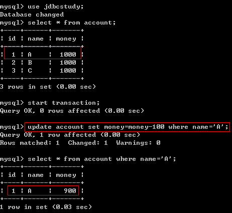
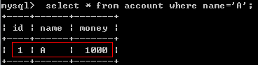
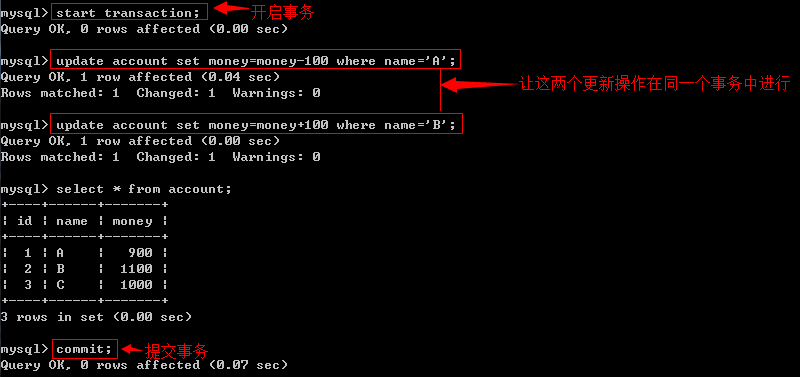
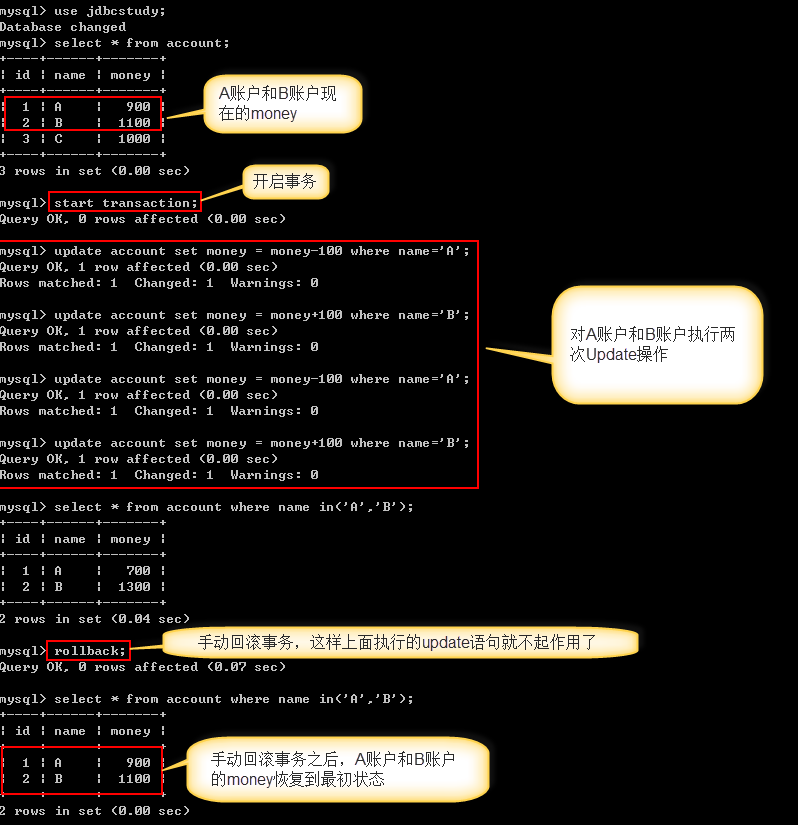

##### 一、事务的概念

​		事务指逻辑上的一组操作，组成这组操作的各个单元，要不全部成功，要不全部不成功。

​		例如：A向B转帐，对应于如下两条sql语句

```mysql
update account set money=money+100 where name='B';
update account set money=money-100 where name='A';
```

##### 二、MySQL数据库中操作事务命令

1、编写测试SQL脚本，如下：

```mysql
/*创建账户表*/
create table account(
	id int primary key auto_increment,
	name varchar(40),
	money float
);
/*插入测试数据*/
insert into account(name,money) values('A',1000);
insert into account(name,money) values('B',1000);
insert into account(name,money) values('C',1000);
```

下面我们在MySQL数据库中模拟A向B转帐这个业务场景：

2.1、开启事务(start transaction)

使用"start transaction"开启MySQL数据库的事务，如下所示：



我们首先在数据库中模拟转账失败的场景，首先执行update语句让A用户的money减少100块钱，如下图所示：



然后我们关闭当前操作的dos命令行窗口，这样就导致了刚才执行的update语句的数据库的事务没有被提交，那么我们对A用户的修改就不算是是真正的修改了，下次在查询A用户的money时，依然还是之前的1000，如下图所示：



2.2、提交事务(commit)

下面我们在数据库模拟A向B转账成功的场景



我们手动提交(commit)数据库事务之后，A向B转账100块钱的这个业务操作算是真正成功了，A账户中少了100，B账户中多了100。

2.3、回滚事务(rollback)



通过手动回滚事务，让所有的操作都失效，这样数据就会回到最初的初始状态！

三、JDBC中使用事务

​		 当Jdbc程序向数据库获得一个Connection对象时，默认情况下这个Connection对象会自动向数据库提交在它上面发送的SQL语句。若想关闭这种默认提交方式，让多条SQL在一个事务中执行，可使用下列的JDBC控制事务语句：

```java
connection.setAutoCommit(false);    // 开启事务(start transaction)
connection.rollback();    // 回滚事务(rollback)
connection.commit();    // 提交事务(commit)
```

3.1、JDBC使用事务范例

​		在JDBC代码中演示银行转帐案例，使如下转帐操作在同一事务中执行：

```mysql
update account set money=money-100 where name='A';
update account set money=money+100 where name='B';
```

代码如下：

```java
/**
 * @Method: testTransaction1
 * @Description: 模拟转账成功时的业务场景
 *
 */
@Test
public void testTransaction1() {
	Connection conn = null;
	PreparedStatement st = null;
	ResultSet rs = null;
	try {
		conn = JdbcUtils.getConnection();
		conn.setAutoCommit(false);    // 通知数据库开启事务(start transaction)
		String sql1 = "update account set money=money-100 where name='A'";
		st = conn.prepareStatement(sql1);
		st.executeUpdate();
		String sql2 = "update account set money=money+100 where name='B'";
		st = conn.prepareStatement(sql2);
		st.executeUpdate();
		conn.commit();// 上面的两条SQL执行Update语句成功之后就通知数据库提交事务(commit)
		System.out.println("成功！！！");
	} catch (Exception e) {
		e.printStackTrace();
	} finally {    
		JdbcUtils.release(conn, st, rs);
	}
}

/**
 * @Method: testTransaction1
 * @Description: 模拟转账过程中出现异常导致有一部分SQL执行失败后让数据库自动回滚事务
 *
 */
@Test
public void testTransaction1() {
	Connection conn = null;
	PreparedStatement st = null;
	ResultSet rs = null;
	try {
		conn = JdbcUtils.getConnection();
		conn.setAutoCommit(false);    // 通知数据库开启事务(start transaction)
		String sql1 = "update account set money=money-100 where name='A'";
		st = conn.prepareStatement(sql1);
		st.executeUpdate();
		// 用这句代码模拟执行完SQL1之后程序出现了异常而导致后面的SQL无法正常执行，事务也无法正常提交，此时数据库会自动执行回滚操作
		int x = 1/0;
		String sql2 = "update account set money=money+100 where name='B'";
		st = conn.prepareStatement(sql2);
		st.executeUpdate();
		conn.commit();// 上面的两条SQL执行Update语句成功之后就通知数据库提交事务(commit)
		System.out.println("成功！！！");
	} catch (Exception e) {
		e.printStackTrace();
	} finally {    
		JdbcUtils.release(conn, st, rs);
	}
}

/**
 * @Method: testTransaction1
 * @Description: 模拟转账过程中出现异常导致有一部分SQL执行失败时手动通知数据库回滚事务
 *
 */
@Test
public void testTransaction1() {
	Connection conn = null;
	PreparedStatement st = null;
	ResultSet rs = null;
	try {
		conn = JdbcUtils.getConnection();
		conn.setAutoCommit(false);    // 通知数据库开启事务(start transaction)
		String sql1 = "update account set money=money-100 where name='A'";
		st = conn.prepareStatement(sql1);
		st.executeUpdate();
		// 用这句代码模拟执行完SQL1之后程序出现了异常而导致后面的SQL无法正常执行，事务也无法正常提交
		int x = 1/0;
		String sql2 = "update account set money=money+100 where name='B'";
		st = conn.prepareStatement(sql2);
		st.executeUpdate();
		conn.commit();// 上面的两条SQL执行Update语句成功之后就通知数据库提交事务(commit)
		System.out.println("成功！！！");
	} catch (Exception e) {
		try {
			// 捕获到异常之后手动通知数据库执行回滚事务的操作
			conn.rollback();
		} catch (SQLException e1) {
			e1.printStackTrace();
		}
		e.printStackTrace();
	} finally {    
		JdbcUtils.release(conn, st, rs);
	}
}
```

3.2、设置事务回滚点

​		 在开发中，有时候可能需要手动设置事务的回滚点，在JDBC中使用如下的语句设置事务回滚点.

```java
Savepoint sp = conn.setSavepoint();
conn.rollback(sp);
conn.commit();    // 回滚后必须通知数据库提交事务
```

四、事务的四大特性(ACID)

4.1、原子性（Atomicity）

​		原子性是指事务是一个不可分割的工作单位，事务中的操作要么全部成功，要么全部失败。比如在同一个事务中的SQL语句，要么全部执行成功，要么全部执行失败

4.2、一致性（Consistency）

​		事务必须使数据库从一个一致性状态变换到另外一个一致性状态。以转账为例子，A向B转账，假设转账之前这两个用户的钱加起来总共是2000，那么A向B转账之后，不管这两个账户怎么转，A用户的钱和B用户的钱加起来的总额还是2000，这个就是事务的一致性。

4.3、隔离性（Isolation）

​		事务的隔离性是多个用户并发访问数据库时，数据库为每一个用户开启的事务，不能被其他事务的操作数据所干扰，多个并发事务之间要相互隔离。

4.4、持久性（Durability）

​		持久性是指一个事务一旦被提交，它对数据库中数据的改变就是永久性的，接下来即使数据库发生故障也不应该对其有任何影响。

​		事务的四大特性中最麻烦的是隔离性，下面重点介绍一下事务的隔离级别

五、事务的隔离级别

​		多个线程开启各自事务操作数据库中数据时，数据库系统要负责隔离操作，以保证各个线程在获取数据时的准确性。

5.1、事务不考虑隔离性可能会引发的问题

​		如果事务不考虑隔离性，可能会引发如下问题：

1、脏读

​		脏读指一个事务读取了另外一个事务未提交的数据。

2、不可重复读

​		不可重复读指在一个事务内读取表中的某一行数据，多次读取结果不同。

​		不可重复读和脏读的区别是，脏读是读取前一事务未提交的脏数据，不可重复读是重新读取了前一事务已提交的数据。

3、虚读(幻读)

​		虚读(幻读)是指在一个事务内读取到了别的事务插入的数据，导致前后读取不一致。

5.2、事务隔离性的设置语句

Serializable(串行化)：可避免脏读、不可重复读、幻读情况的发生。

Repeatable read(可重复读)：可避免脏读、不可重复读情况的发生。mysql默认隔离级别

Read committed(读已提交)：可避免脏读情况发生。

Read uncommitted(读未提交)：最低级别，以上情况均无法保证。

mysql数据库查询当前事务隔离级别：select @@tx_isolation

​		