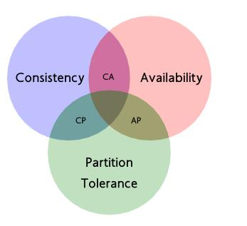
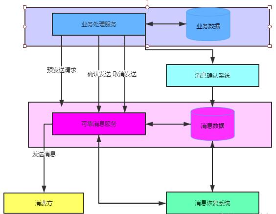

##### 前言

随着微服务架构的盛行，分布式事务成为大部分企业集成中的一个技术难点，特别是在微服务架构体系下，这个问题尤其突出，可以说是无可避免。可能每个人对微服务的理解都不太一样，下面就聊下分布式事务涉及到的一些概念性的东西，为后续实战做一些理论基础。

##### 本地事务

我们先从本地事务（数据库事务）说起吧，因为这个是大家在日常工作都接触到，开发过程中都会用到的。

事务：由一系列操作构成，独立的操作单元；具有ACID四大特性，分别为：原子性、一致性、隔离性和持久性。

优点：本地事务由事务管理器本地自行管理；支持严格的ACID四大特性，高效，可靠；

缺点：多个数据源搞不定，不具备分布式事务处理能力。

##### 全局事务

说明：X/Open DTP定义了三个组件：RM和两个协议：XA、TX

APP（Application Program）：应用程序

RM（Resource Manager）：资源管理器，这里可以理解为一个DBMS系统。两个要求：一个是RM自身必须是支持事务的，二是RM能够根据将全局（分布式）事务标识定位到自己内部的对应事务。

TM（Transaction Manager）：事务管理器，负责协调和管理事务，提供给APP应用程序编程接口以及资源管理器。能与APP和RM直接通信，协调APP和RM来实现分布式事务的完整性。主要的工作是提供APP注册全局事务的接口，颁发全局事务标识（GTID之类的），存储/管理全局事务的内容和决策并指挥RM做commit/rollback。

XA协议：应用程序APP与事务管理器TM之间通信的接口

TX协议：全局事务管理器TM与资源管理器RM之间通信的接口

###### 二阶段提交

1、准备阶段：全局事务管理器（TM）给每个参与者（资源管理器）发送Prepare消息，每个资源管理器要么直接返回失败，要么在本地执行事务，写本地的**redo**和**undo**日志，但不提交。

2、提交阶段：如果全局事务管理器（TM）收到了参与者的失败消息或者超时，直接给每个参与者发送回滚（rollback）消息，否则，发送提交（commit）消息；参与者根据协调者的指令执行提交或回滚操作，释放所有事务处理过程中使用的锁资源。（注意：必须在最后阶段释放锁资源）

将提交分成两阶段进行的目的很明确，就是尽可能晚地提交事务，让事务在提交前尽可能地完成所有能完成的工作，这样，最后的提交阶段是一个耗时极短的微小操作，这种操作在一个分布式系统中失败的概率是非常小的，这是二阶段提交确保分布式事务原子性的关键所在。

##### Base理论

BASE是Basically Available（基本可用）、Soft state（软状态）和Eventually consistent（最终一致性）三个短语的缩写。BASE理论是对CAP中一致性和可用性权衡的结果，其来源于对大规模互联网系统分布式实践的总结，是基于CAP定理逐步演化而来的。BASE理论的核心思想是：即使无法做到强一致性，但每个应用都可以根据自身业务特点，采用适当的方式来使系统达到最终一致性。

###### 1、基本可用

基本可用是指分布式系统在出现不可预知故障的时候，允许损失部分可用性—-注意，这绝不等价于系统不可用。比如：

（1）响应时间上的损失：由于出现故障，允许查询结果响应时间慢1~2秒。

（2）系统功能上的损失：比如商务网站，节日大促的时候，为了保证购物系统的稳定，允许部分消费者引导到一个降级页面。

###### 2、软状态

###### 3、最终一致性

最终一致性强调的是所有的数据副本，在经过一段时间的同步之后，最终都能够达到一个一致的状态。因此，最终一致性的本质是需要系统保证最终数据能够达到一致，而不需要实时保证系统数据的一致性。

##### CAP理论

对于共享数据系统，最多只能同时拥有CAP理论中的两者，没法全部兼顾。

任意两者的组合都有使用的业务场景

##### 1、一致性

在分布式环境下，一致性是指数据在多个副本之间能否保持一致性的特性。在一致性的需求下，当一个系统在数据一致的状态下执行更新操作后，应该保证系统的数据仍然处于一致的状态。

##### 2、可用性

可用性是指系统提供的服务必须一直处于可用的状态，对于用户的每一个操作请求总是能够在有限的时间内返回结果。这里的重点是“有限时间内”和“返回结果”。

##### 3、分区容错性

分区容错性约束了一个分布式系统具有如下特性：分布式系统在遇到任何网络分区故障的时候，仍然需要能够保证对外提供满足一致性和可用性的服务，除非是整个网络环境都发生了故障。

网络分区是指在分布式系统中，不同的节点分布在不同的子网络（机房或者异地网络）中，由于一些特殊的原因导致这些子网络出现网络不连通的状况，但各个子网络的内部网络是正常的，从而导致整个系统的网络环境被切分成了若干个孤立的区域。

**选择说明：**

CA：放弃分区容错性，加强一致性和可用性，其实就是传统的单机数据库的选择

AP：放弃一致性（这里说的强一致性），追求分区容错性和可用性，这是很多分布式系统设计时的选择。

CP：放弃可用性，追求一致性和分区容错性。基本不会选择，网络问题会导致整个系统不可用。

##### 解决方案

* 可靠消息的最终一致性（异步确保）

  

