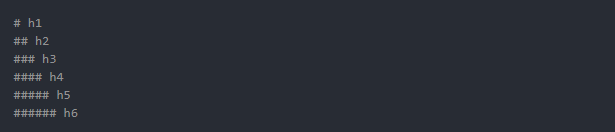
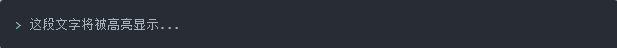
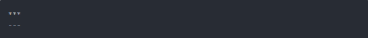
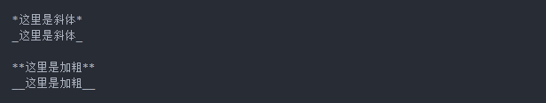

### 基础语法

#### 标题

Markdown支持6种级别的标题，对应html标签h1~h6

以上标记效果如下：

# h1

## h2

### h3

#### h4

##### h5

###### h6

除此之外，Markdown还支持另外一种形式标题展示形式，其类似于Setext标记语言的表现形式，使用下划线进行文本大小的空值

#### 段落及区块引用

需要记住的是，Markdown其实就是易于编写的普通文本，只不过加入了部分渲染文本的标签而已。其最终依然会转换为html标签，因此使用Markdown分段非常简单，前后至少保留一个空行即可。

而另外一个比较常见的需求就是，我们可能希望对某段文字进行强调处理。Markdown提供了一个特殊符号>用于段首进行强调，被强调的文字部分将会高亮显示

以上标记显示效果如下：

> 这段文字将被高亮显示...

#### 插入链接或图片

Markdown针对链接和图片处理也比较简单，可以使用下面的语法进行标记

[点击跳转至百度](https://www.baidu.com/)

注：引用图片和链接的唯一区别就是在最前方添加一个感叹号。

#### 列表

Markdown支持有序列表和无序列表两种形式：

* 无序列表使用*或+或-标识
* 有序列表使用数字加.标识，例如：1.

#### 使用列表的一些注意事项

如果在单一列表项中包含了多个段落，为了保证渲染正常，*与段落首字母必须保留四个空格

*    段落一

     小段一

* ​    段落二

  ​    小段二

*    段落一

  > 区块标记一

#### 分割线

有时候，为了排版漂亮，可能会加入分割线。Markdown加入分割线非常简单，使用下面任意一种形式都可以

***

---

#### 强调

有时候，我们希望对某一部分文字进行强调，使用*或_包裹即可。使用单一符号标记的效果是斜体，使用两个符号标记的效果是加粗

*这里是斜体*

_这里是斜体_

**这里是加粗**

__这里是加粗__

#### 高级用法

##### 插入代码块

Markdown在IT圈子里面比较流行的一个重要原因是，它能够轻松漂亮地插入代码。

方法是，使用反引号`进行包裹即可。如果是行内代码引用，使用单个反引号进行包裹

这是一段`var x = 3`行内代码

如果插入一整段代码，需要至少使用两个以上反引号进行包裹。

###### 注：很多人不知道怎么输入反引号。在英文模式下，找到键盘最左侧esc键下面的第一个键点击即可。

